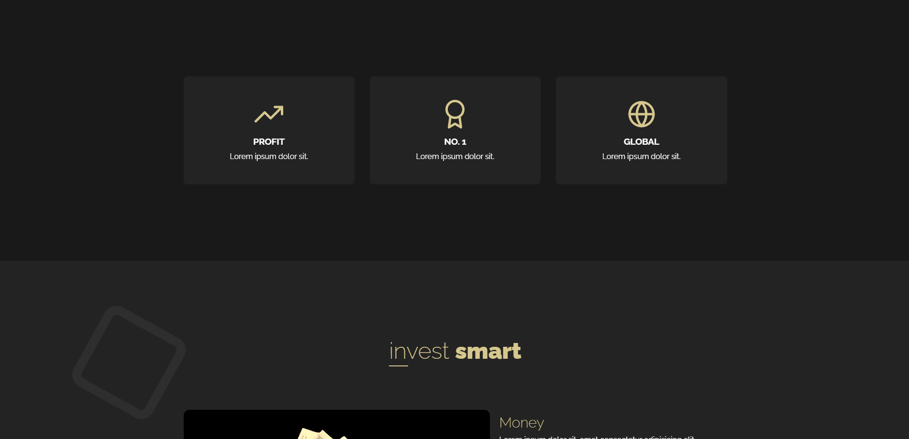

 

<h1 align="center">Page for investment</h1>

  

  The site on which you will invest your money  

  

## How to start  
To view the demo you need to go to the link provided below:

  

<a align="center" href='https://szafter12.github.io/Grid-site/#cards'>View demo</a>

  

## About The Project

The site was made as part of a web development course. This is the final project of one of the courses I attended 

### Built With

HTML
 
SCSS
 
JavaScript
 

## Contact

Jakub Pachut - jakubpachut@gmail.com

Project Link: https://github.com/Szafter12/Tourist-site-PL
